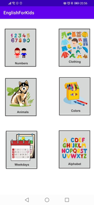
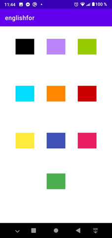

# English For Kids
Aplicación android para el aprendizaje del idioa inglés enfocado en niños.

Para facilitar el aprendizaje de mlos niños, la aplicación se enfoca en relacionar un concepto con diferente representaciones del mismo, ya sea visual, auditivo. De esta manera el cerebro del niño podrá identificar de manera más sencilla los conceptos mentalmente, sin necesidad de una carga por el idioma materno.

## Menu

### Días de la semana

### Animales

### Abecedario

### Ropa

### Colores

### Números

### Ejemplo

